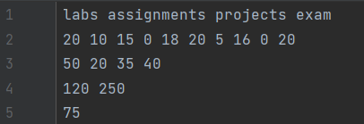
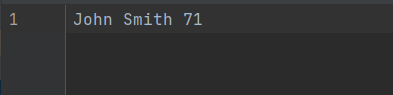
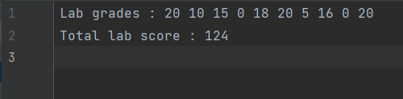
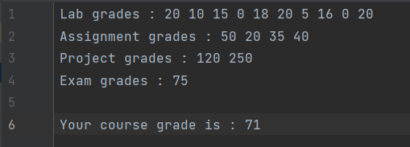

# Review project for CSC 212

## Summary of Project:

The user is able to use command line arguements (CLA) to decide what grades they would like to see for CSC 212. The variations include:

- Individual grade, where the user sees their name and overall course grade.
- Category grade, where the user can decide what category out of lab, assignment, project and exam they would like to see their grade in.
- Course grade, where the user can choose between three options
  1. Seeing all grades within categories and overall grade for the course.
  2. Seeing total grades from each category and overall grade for the course.
  3. Seeing only course grade.

Once one of these options are chosen, the file with the grades are read and the output is written back into a file to be viewed by the user.  
&nbsp;  

## Pseudocode for choice of user in main.cpp:

&emsp;If "Individual" is CLA 5, then  
&emsp;&emsp;&emsp;&emsp;- go to the individual member function of the gradebook class to calculate overall grade  
&emsp;&emsp;&emsp;&emsp;- go to Individual write member function to write to specified output file  
&nbsp;  
&emsp;else if "Category" is CLA 5, then  
&emsp;&emsp;&emsp;&emsp;- read in what category was typed by the user after the prompt  
&emsp;&emsp;&emsp;&emsp;- go to the Category member function of the gradebook class to calculate the grade of specified category  
&emsp;&emsp;&emsp;&emsp;- go to Category write member function to write to specified output file  
&nbsp;  
&emsp;else if "Course" is CLA 5, then  
&emsp;&emsp;&emsp;&emsp;- read in what choice was typed by the user after the prompt  
&emsp;&emsp;&emsp;&emsp;- go to the Course write member function of the gradebook class where depending on the choice,  
&emsp;&emsp;&emsp;&emsp;&emsp;different grades will write to the file  
&nbsp;  
&emsp;else  
&emsp;&emsp;&emsp;&emsp;Tell user that CLA 5 is not one of the three choices  
&nbsp;  
      
## Detailed Instructions on use of program:

  **CLA format:**   First_Name Last_Name input_file output_file output_type  
&emsp;&emsp;&emsp;&emsp;First_Name = the first name of the user  
&emsp;&emsp;&emsp;&emsp;Last_Name = the last name of the user  
&emsp;&emsp;&emsp;&emsp;input_file = file name that user wants the grades/categories to be read from  
&emsp;&emsp;&emsp;&emsp;output_file = file name that user wants the output to be written to  
&emsp;&emsp;&emsp;&emsp;output_type = users choice of "Individual", "Category" or "Course"  
&nbsp;  
        
**CLA example for Individual:** &emsp;John Smith grades.txt finalGrades.txt Individual
  
**CLA example for Category:** &emsp;John Smith grades.txt finalGrades.txt Category    
  (A prompt is then sent to user, where they type "lab", "assignment", "project" or "exam", depending on what grades the user wants)
  
**CLA example for Course:** &emsp;John Smith grades.txt finalGrades.txt Course      
  (A prompt is then sent to user explaining the choices, where the user types "1","2" or "3" depending on what grades the user wants)  
&nbsp;  
&nbsp;  

  **_IMPORTANT_**: ***Fifth CLA and all choices in prompts are case and spelling sensitive***  
&nbsp;  

## Sample Images

### Sample Input file

  

&emsp;&emsp;Line 1 has all the categories  
&emsp;&emsp;Line 2 are lab grades  
&emsp;&emsp;Line 3 are assignment grades  
&emsp;&emsp;Line 4 are project grades  
&emsp;&emsp;Line 5 is exam grade  

### Sample Individual Output File  

  

&emsp;&emsp;Line 1 has the users name and the course grade in percent next to it  

### Sample Category Output File for Labs  

  

&emsp;&emsp;Line 1 has all lab grades  
&emsp;&emsp;Line 2 has total lab grade  

### Sample Course Output File for Choice 1  

  

&emsp;&emsp;Line 1 has all lab grades  
&emsp;&emsp;Line 2 has all assignment grades  
&emsp;&emsp;Line 3 has all project grades  
&emsp;&emsp;Line 4 has exam grade  
&emsp;&emsp;Line 6 has course grade in percent  

          
